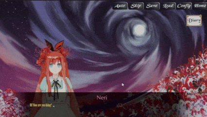
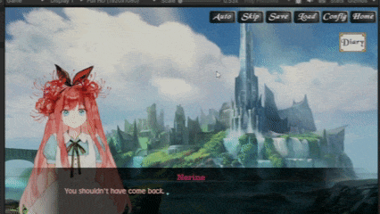
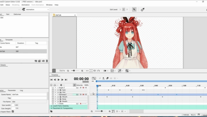

# Project Nostalgia

Project Nostalgia is a 2D visual novel framework built with Unity and C#.  
It uses a custom dialogue interpreter to read plain-text chapter scripts and
translate them into dialogue, character actions, audio, visual effects, player
choices, and scene commands.

## Gameplay Preview

| Dialogue System | Branching Choice and Diary |
|:---:|:---:|
|  |  |
| Script-driven dialogue, character presentation, and typewriter text | Player choices connected to affection and diary progression |

### Live2D Integration

  

  Live2D character parameters, expressions, and motions controlled.

## Presentation Layers

The visual novel interface is organized into six presentation layers:

1. Background
2. Characters
3. Dialogue
4. Cinematic effects
5. Foreground
6. Player controls

This layered structure allows visual elements and UI components to be controlled
independently through commands defined in chapter scripts.

## Core Features

- Script-based dialogue interpreter
- Queued conversation system
- Typewriter text, auto-read, and skip modes
- Branching dialogue and player choices
- Character movement, expressions, highlighting, and sprite transitions
- Background, foreground, and cinematic graphic panels
- Music, ambience, voice, and sound-effect controls
- Dialogue history and text logs
- Input prompts and configurable UI
- JSON-based save/load system
- Save-slot timestamps and screenshot previews
- File handling and optional save-data encryption
- Gallery system
- Live2D Cubism character integration
- Minigame scene transitions
- Story variables and affection tracking

## Current Development

The project is currently in development. The present focus is on expanding the
diary and character-profile UI, integrating the affection system with story
events, and improving minigame transitions.

## Built With

- Unity
- C#
- TextMeshPro
- Live2D Cubism SDK

## Acknowledgements

- Live2D Cubism SDK
- TextMeshPro
- Serialized Collections
- Any tutorials, code samples, external packages, or assets used during development

## Owner

Tran Quoc Tuan - 2311557577
